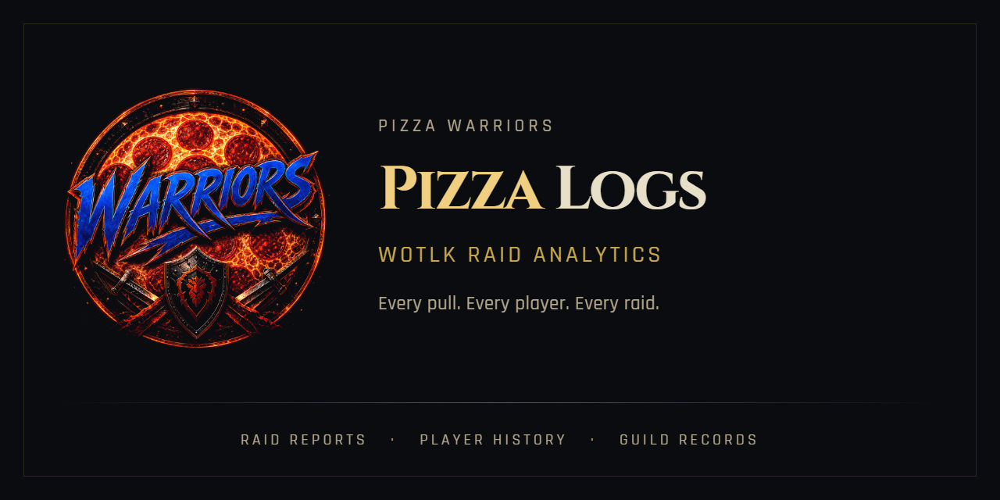
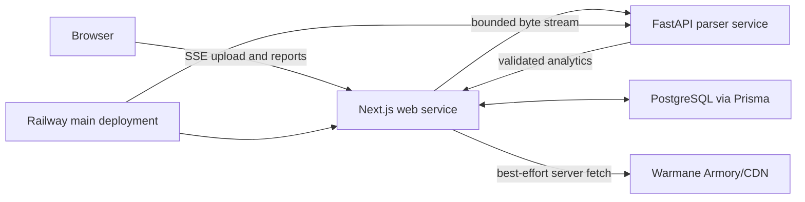

# Pizza Logs



[](https://github.com/CRSD-Lau/Pizza-Logs/actions/workflows/ci.yml)
[](https://github.com/CRSD-Lau/Pizza-Logs/actions/workflows/codeql.yml)
[](https://github.com/CRSD-Lau/Pizza-Logs/actions/workflows/production-smoke.yml)
[](LICENSE)

Pizza Logs turns Wrath of the Lich King combat logs into readable raid sessions, boss pulls, DPS/HPS records, player profiles, gear snapshots, and progression summaries. It is built for PizzaWarriors on Warmane Lordaeron, while remaining useful for compatible WotLK 3.3.5a logs.

[Open the live app](https://pizza-logs-production.up.railway.app) · [Read the docs](docs/README.md) · [Report a bug](https://github.com/CRSD-Lau/Pizza-Logs/issues/new/choose) · [Report a vulnerability privately](https://github.com/CRSD-Lau/Pizza-Logs/security/advisories/new)

## What It Does

- Streams `.txt`, `.log`, or `.zip` uploads with live progress and bounded server-side validation.
- Detects boss encounters even when Warmane omits useful encounter markers.
- Preserves Skada-WoTLK damage/healing primitives. UwU reference comparisons and known differences are tracked in the [parity contract](docs/uwu-analytics-parity.md); broad equivalence is not claimed.
- Reports raid sessions, boss attempts, target damage, healing, absorbs, deaths, auras, consumables, power gains, specs, roles, and pets.
- Offers All Boss Attempts and Successful Boss Fights views with matching player totals, target damage and rates; full-session trash and downtime remain a separate view.
- Tracks all-time records, weekly results, boss history, and player performance.
- Adds first-party Warmane roster and gear lookups with durable cached fallback.
- Protects diagnostics, cleanup, import, and refresh controls behind server-side admin authentication.
- Runs as separate Next.js and FastAPI services backed by PostgreSQL on Railway.

## How It Fits Together



The browser never receives database credentials, parser filesystem paths, or the admin secret. Raw uploads are streamed through the web service, validated by the parser, reduced to structured analytics, and removed from parser temporary storage after processing.

## Stack

| Layer | Technology |
| --- | --- |
| Web | Next.js 16.3, React 19.2, Node.js 24 |
| Language | TypeScript 7 native CLI plus TypeScript 6 ecosystem check |
| UI | Tailwind CSS 4, Recharts 3 |
| Data | PostgreSQL, Prisma 7 |
| Parser | Python 3.14, FastAPI, Pydantic |
| Hosting | Railway, separate web and parser services |
| Security automation | CodeQL, Dependabot, dependency review, pinned Actions |

## Quick Start

Prerequisites:

- Node.js 24.x and npm 11+
- Python 3.14
- PostgreSQL 16, or Docker Desktop

Install the web dependencies and create local configuration:

```bash
npm ci --legacy-peer-deps
cp .env.example .env.local
npm run db:generate
npx prisma migrate deploy
npm run db:seed
```

Install the parser from the reviewed, hash-locked dependency set:

```bash
python -m venv parser/.venv
```

Install dependencies with the virtual environment's interpreter:

```powershell
# Windows
.\parser\.venv\Scripts\python.exe -m pip install --require-hashes -r .\parser\requirements-dev.lock
```

```bash
# macOS/Linux
parser/.venv/bin/python -m pip install --require-hashes -r parser/requirements-dev.lock
```

Start the parser and web app in separate terminals:

```powershell
# Windows
.\parser\.venv\Scripts\python.exe .\parser\main.py
```

```bash
# macOS/Linux
parser/.venv/bin/python parser/main.py
```

```bash
# Either platform, in the web-app terminal
npm run dev
```

Then open <http://localhost:3000>. A local production-style stack is also available:

Set a random `ADMIN_SECRET` of at least 32 characters in `.env.local` before starting Compose.

```bash
docker compose --env-file .env.local up --build
```

See [development setup](docs/development/setup.md) for database, item metadata, Windows launchers, and environment details.

## Configuration

| Variable | Required | Purpose |
| --- | --- | --- |
| `DATABASE_URL` | Yes | PostgreSQL connection used by Prisma |
| `PARSER_SERVICE_URL` | Yes | Internal FastAPI service base URL |
| `ADMIN_SECRET` | Yes for admin | Server-only signing/encryption key, at least 32 random characters; never a browser login credential |
| `ADMIN_AUTH_URL` | Yes for admin | Exact public HTTPS origin; loopback HTTP is supported for isolated development |
| `ADMIN_COOKIE_SECURE` | Local HTTP only | Set `false` only for local production-mode HTTP |
| `ENABLE_LEGACY_PARSER_ROUTES` | No | Local parser compatibility escape hatch; disabled by default |

Never commit local `.env` files. The checked-in [`.env.example`](.env.example) contains placeholders only.

Admin access uses an operator-provisioned account, an authenticator code and revocable sessions.
Follow [admin account setup and recovery](docs/operations/admin-access.md) before enabling it.

## Validation

The complete web/TypeScript gate is:

```bash
npm run check:pr
```

The parser gate is:

```bash
cd parser
pytest tests/ -v
```

Parser behavior changes require focused pytest or fixture coverage. `parser/tests/fixtures/README.md` explains the fixture format. Useful additional checks are documented in [testing](docs/development/testing.md).

## Parser Guarantees

Parser correctness is the product. The detailed contract lives in [docs/parser-contract.md](docs/parser-contract.md); the short version is:

- Skada-WoTLK defines the supported damage/healing event sets and effective-healing primitive.
- Headline outgoing damage and damage taken use raw combat-log amounts; useful/effective damage is separate.
- Absorbs stay separate from effective healing, with an explicitly labeled healing-plus-absorbs comparison view.
- Encounter windows end on boss-destination activity, with boss death as the kill endpoint.
- Difficulty, pet ownership, and absorb ownership remain unknown/unattributed when evidence conflicts or is missing.
- Gunship, Lich King scripted phases, Warmane GUIDs, back-to-back pulls, and pet ownership are regression tested.

## Public Routes

| Route | Purpose |
| --- | --- |
| `/` | Upload and project summary |
| `/raids` | Public raid history |
| `/raids/[report]/sessions/[date]` | Canonical dated raid session |
| `/encounters/[id]` | Boss-pull breakdown |
| `/leaderboards` | Top-three all-time average DPS/HPS across logged boss attempts and per-boss personal-best kill records |
| `/players` and `/players/[name]` | Player directory and profiles |
| `/guild-roster` | Cached PizzaWarriors roster |
| `/weekly` | Weekly kills and performance |
| `/bosses` and `/bosses/[slug]` | Boss-specific history and rankings |
| `/admin` | Authenticated diagnostics and maintenance |

Legacy numeric/CUID upload links redirect to canonical public raid URLs where a public report exists. The retired userscript update URLs remain inert only to safely disable old installations.

## Documentation

- [Documentation index](docs/README.md)
- [Architecture](docs/architecture/overview.md)
- [Upload protocol](docs/archive-upload-protocol.md)
- [Parser contract](docs/parser-contract.md)
- [UwU analytical parity](docs/uwu-analytics-parity.md)
- [Security policy](SECURITY.md) and [threat model](docs/security/threat-model.md)
- [Railway runbook](docs/operations/railway.md)
- [Contribution workflow](CONTRIBUTING.md)
- [Changelog](CHANGELOG.md)
- [Privacy](PRIVACY.md)

## Contributing

Use a short-lived branch from current `origin/main`, keep changes scoped, run the relevant gates, and open a pull request. Do not push directly to `main`. Parser, schema, upload, admin, security, and deployment changes need especially clear evidence.

See [CONTRIBUTING.md](CONTRIBUTING.md) and [AGENTS.md](AGENTS.md).

## Privacy, Security, and License

Raid reports contain public in-game character names and performance data. Pizza Logs has no end-user account system, advertising SDK, or payment flow. Read [PRIVACY.md](PRIVACY.md) for collection and retention details.

Please report vulnerabilities through a [private GitHub security advisory](https://github.com/CRSD-Lau/Pizza-Logs/security/advisories/new), not a public issue. Security controls and known residual risks are documented in [SECURITY.md](SECURITY.md).

The project is released under the [MIT License](LICENSE). World of Warcraft and related marks are property of Blizzard Entertainment; Warmane and other referenced services are independent third parties. See [THIRD_PARTY_NOTICES.md](THIRD_PARTY_NOTICES.md).
