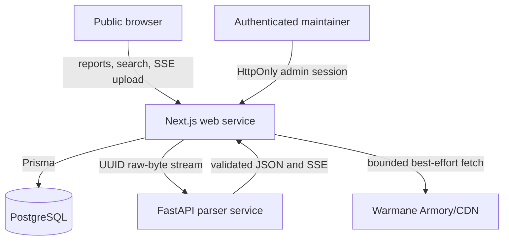

# Architecture Overview

Pizza Logs is a two-service application: a Next.js web/API service and a Python parsing service. PostgreSQL is the durable store. Railway deploys both services from the same Git commit on `main`.

## Runtime Topology



## Web Service

`app/` contains App Router pages, server actions, and route handlers. `components/` contains client/server UI. `lib/` owns database clients, schemas, raid URL construction, parser-response validation, analytics helpers, and Warmane integrations.

The public browser communicates only with the Next.js service. The web service:

1. validates upload metadata and request shape;
2. forwards the body as a stream to the parser;
3. validates parser output with Zod;
4. deduplicates files and encounters;
5. persists reports through Prisma;
6. returns a canonical public report URL.

Admin actions reuse one server-side authentication helper. Production fails closed if the configured secret is missing.

## Parser Service

`parser/main.py` is a thin HTTP and worker boundary around `parser/parser_core.py`, archive validation, quick classification, and boss/difficulty rules. The parser receives raw bytes into a unique temporary file, validates format/resource limits, emits a quick difficulty result, then performs full aggregation on a bounded worker pool.

The modern route is `POST /uploads/{uuid}/stream`. Legacy multipart/debug/stream routes are default-disabled and exist only as a temporary local compatibility escape hatch. There is no arbitrary filesystem parse route.

Parser behavior is frozen by focused tests, fixture directories, and analytical baselines. See [parser contract](../parser-contract.md).

## Data Model

The durable core is:

```text
Realm -> Guild -> Upload -> Encounter -> Participant -> Player
                               |
                               +-> Milestone

Player/roster -> ArmoryGearCache -> WowItem enrichment
```

- `Upload.fileHash` prevents exact file re-imports.
- `Encounter.fingerprint` prevents the same pull from being persisted twice while allowing back-to-back same-roster attempts.
- `Upload.publicSlug` plus a persisted raid-session start date forms canonical public URLs.
- Combat primitives and derived session analytics are stored separately so future presentation changes do not rewrite parser truth.

Prisma schema and migrations are in `prisma/`. Production applies committed migrations during web startup.

## External Data

Warmane roster, character, and gear fetches are server-side and best effort. Successful results are cached in PostgreSQL. A failed live request falls back to the last healthy snapshot rather than failing an otherwise valid page.

The desktop model viewer is an isolated `srcdoc` iframe with `sandbox="allow-scripts"`, no same-origin permission, no referrer, and its own restrictive CSP. The parent page does not pass credentials or database data to it.

## Trust Boundaries

- **Public input:** upload bytes, filename, UUID, optional labels, filters, and search terms are untrusted.
- **Parser output:** treated as untrusted until schema validation succeeds.
- **Admin input:** authenticated but still validated; authentication is not input validation.
- **Warmane responses:** untrusted upstream HTML/JSON parsed into bounded fields.
- **Database data:** may contain old rows created by earlier parser versions; UI code must handle missing optional analytics.
- **CI dependencies:** GitHub Actions are commit-pinned; package resolution is lockfile/hash based.

Detailed threats and controls are in [the threat model](../security/threat-model.md).
