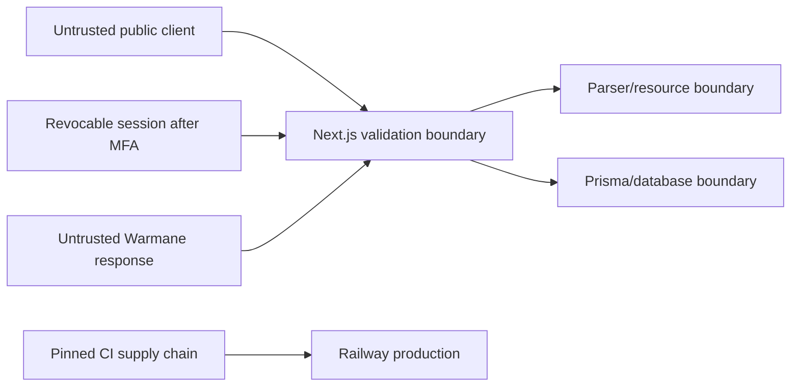

# Threat Model

Author: Neil Mitchell
Last Modified By: Neil Mitchell
Last reviewed: 2026-09-06

## Scope and Assets

Protected assets include the admin secret, database credentials, Railway/webhook tokens, database integrity, production availability, private operational diagnostics, and temporary raw upload bytes. Public raid reports and in-game character data are intentionally public but must not expose internal metadata or secrets.

## Trust Boundaries

## Threats and Controls

| Threat | Control | Remaining risk |
| --- | --- | --- |
| Oversized upload or slow body | Independent web/parser byte counters, exact size agreement, receive timeout, four active web requests and 12 starts per minute per process | Distributed rate limiting is not implemented; a bot can consume the bounded capacity |
| Junk, malware disguised as logs or unwanted archive payloads | Single regular log per ZIP, empty safe folders only, full-file recognized event validation, binary/control rejection and complexity limits | No antivirus engine; crafted plausible logs cannot be authenticated; no zero-malware guarantee |
| Unacknowledged/cross-site upload | Current policy header checked before body/parser/database; browser Origin matches configured trusted site and cross-site Fetch Metadata is rejected | CLI clients can acknowledge directly; no identity verification or durable consent record |
| ZIP bomb/path traversal | Size, ratio, entry/metadata, path, encryption, symlink, duplicate-name and nested-archive rejection; no extraction; bounded physical-line reader | Input size and admission are bounded; thread execution has cooperative cancellation rather than a hard CPU deadline |
| Cancellation or timed-out work exhausts admission/storage | Receive cancellation finalizes ownership; pending tasks are cancelled; admission/files remain owned until actual workers stop; active files excluded from abandoned cleanup | Stuck aggregation retains capacity until worker/process termination; hard isolation needs worker processes |
| Upload ID collision/state theft | Strict lowercase UUIDv4; 409 on retained-ID reuse; bounded ephemeral state with terminal eviction | Anyone who learns a live UUID can read its non-secret progress state; restarts/eviction lose progress |
| Parser filesystem access | Arbitrary path route removed; only verified upload directory files are opened | Deployment filesystem permissions remain defense in depth |
| Internal error disclosure and forged log entries | Fixed public error codes/messages; modern parser logs include validated correlation IDs and exception types without raw exception text; JSON encoding and explicit CR/LF escaping at the log sink retain one line per event | Operational logs remain sensitive; local opt-in legacy routes retain diagnostic traces |
| Raw upload/database enumeration | No public upload-row listing or file download; original filenames omitted from public encounter APIs | Public reports expose game identities by design; progress UUIDs act as bearer identifiers |
| Admin bypass | Operator-provisioned identity, mandatory TOTP, server-recorded per-session MFA, live database authorization on pages/actions/APIs, no legacy secret paths | Protect the server key and operator recovery access; deployed enrollment must be verified |
| Secret leakage in URL/client | Admin query-string import removed; no browser storage; server-only variables | Maintainer handling and screenshots remain human risks |
| Cross-site scripting/content injection | React escaping, schema/input constraints, CSP, Slack escaping | CSP allows inline script/style for Next.js and isolated model compatibility |
| Clickjacking | CSP `frame-ancestors 'none'` and `X-Frame-Options: DENY` | None known |
| Untrusted model-viewer code | Sandboxed no-same-origin `srcdoc`, no referrer, narrow iframe CSP | Upstream model availability/code can fail within the frame |
| Compromised dependency/action | npm lock, Python hashes, audit/review, CodeQL, immutable Action SHAs, Dependabot | Package-manager ecosystem compromise is not eliminated |
| Excessive container privilege | Web and parser images run as non-root users | Railway/control-plane privileges remain external |
| Incorrect parser analytics | Fixtures, focused tests, baselines, conservative unknowns | Undocumented Warmane behavior can require new evidence |
| Destructive migration | PR-only main, migration inspection, deploy gate, forward-correction runbook | Startup migration can block availability if incorrectly designed |

## Abuse Cases

Expected public use includes uploading valid combat logs and browsing reports. The following are abuse:

- repeated high-volume uploads intended to exhaust capacity;
- crafted archives intended to escape resource/path limits;
- guessing admin credentials or replaying leaked secrets;
- using public API/report views to discover protected operational data;
- injecting mentions/markup into automation messages;
- committing secrets, real raw logs, database exports, or personal paths.

## Security Invariants

1. Production admin access fails closed.
2. Raw upload bytes never become a public download and are removed after their last worker releases the file, with deferred stale-file cleanup after storage failures.
3. Parser paths are server-generated inside the upload directory.
4. The production streaming upload enforces byte/line/archive limits, bounded admission and worker response deadlines. Local opt-in legacy paths are not production equivalents and must remain disabled.
5. Public error payloads do not contain stack traces, filesystem paths, database text, or upstream secrets.
6. `main` changes flow through required checks; Actions are commit-pinned.
7. Missing parser evidence is unknown/unattributed rather than guessed.

The dated [upload security review](upload-security-review.md) records verified defects, remediation, scope and residual resource risks. Disclaimers and acknowledgement support user understanding; they do not replace technical controls.

## Review Triggers

Update this model when adding authentication, user accounts, a public API contract, analytics/telemetry, a new upload format, a new upstream service, object storage, multiple parser replicas, a database migration strategy, or a materially different deployment platform.
