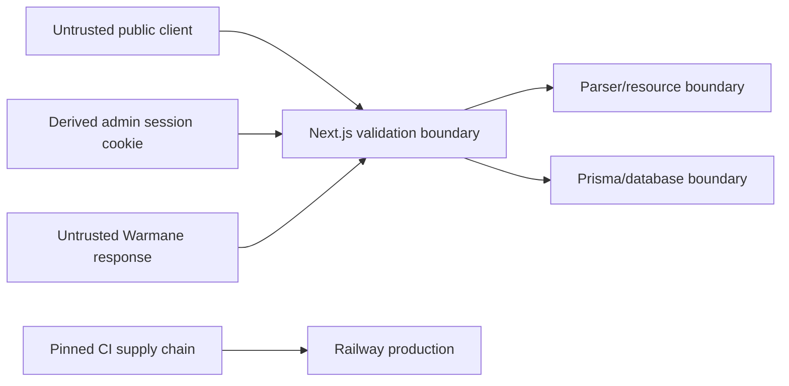

# Threat Model

Last reviewed: 2026-08-15

## Scope and Assets

Protected assets include the admin secret, database credentials, Railway/webhook tokens, database integrity, production availability, private operational diagnostics, and temporary raw upload bytes. Public raid reports and in-game character data are intentionally public but must not expose internal metadata or secrets.

## Trust Boundaries

## Threats and Controls

| Threat | Control | Remaining risk |
| --- | --- | --- |
| Oversized upload or slow body | Web metadata/content-length checks, parser streaming byte counter, receive timeout | Distributed rate limiting is not implemented |
| ZIP bomb/path traversal | Size, ratio, member, path, encryption, symlink, and nested-archive rejection; no extraction | Parser work still consumes bounded CPU/time |
| Upload ID collision/state theft | Strict random UUIDv4; 409 on reuse; ephemeral state | Anyone who learns a live UUID can read its non-secret progress state |
| Parser filesystem access | Arbitrary path route removed; only verified upload directory files are opened | Deployment filesystem permissions remain defense in depth |
| Internal error disclosure | Fixed public error codes/messages; detailed exceptions logged server-side | Operational logs remain sensitive |
| Raw upload/database enumeration | No public upload-row listing; canonical report routes expose only intended reports | Public reports expose game identities by design |
| Admin bypass | Production fail-closed secret, HttpOnly strict cookie, route/action checks | Shared-secret model has no per-user audit identity or MFA |
| Secret leakage in URL/client | Admin query-string import removed; no browser storage; server-only variables | Maintainer handling and screenshots remain human risks |
| Cross-site scripting/content injection | React escaping, schema/input constraints, CSP, Slack escaping | CSP allows inline script/style for Next.js and isolated model compatibility |
| Clickjacking | CSP `frame-ancestors 'none'` and `X-Frame-Options: DENY` | None known |
| Untrusted model-viewer code | Sandboxed no-same-origin `srcdoc`, no referrer, narrow iframe CSP | Upstream model availability/code can fail within the frame |
| Compromised dependency/action | npm lock, Python hashes, audit/review, CodeQL, immutable Action SHAs, Dependabot | Package-manager ecosystem compromise is not eliminated |
| Excessive container privilege | Web and parser images run as non-root users | Railway/control-plane privileges remain external |
| Incorrect parser analytics | Fixtures, focused tests, baselines, conservative unknowns | Undocumented Warmane behavior can require new evidence |
| Destructive migration | PR-only main, migration inspection, deploy gate, forward-correction runbook | Startup migration can block availability if incorrectly designed |

## Abuse Cases

Expected public use includes uploading valid combat logs and browsing reports. The following are abuse:

- repeated high-volume uploads intended to exhaust capacity;
- crafted archives intended to escape resource/path limits;
- guessing admin credentials or replaying leaked secrets;
- using public API/report views to discover protected operational data;
- injecting mentions/markup into automation messages;
- committing secrets, real raw logs, database exports, or personal paths.

## Security Invariants

1. Production admin access fails closed.
2. Raw upload bytes never become a public download and are removed from parser temp storage.
3. Parser paths are server-generated inside the upload directory.
4. Every upload path enforces byte and processing limits.
5. Public error payloads do not contain stack traces, filesystem paths, database text, or upstream secrets.
6. `main` changes flow through required checks; Actions are commit-pinned.
7. Missing parser evidence is unknown/unattributed rather than guessed.

## Review Triggers

Update this model when adding authentication, user accounts, a public API contract, analytics/telemetry, a new upload format, a new upstream service, object storage, multiple parser replicas, a database migration strategy, or a materially different deployment platform.
